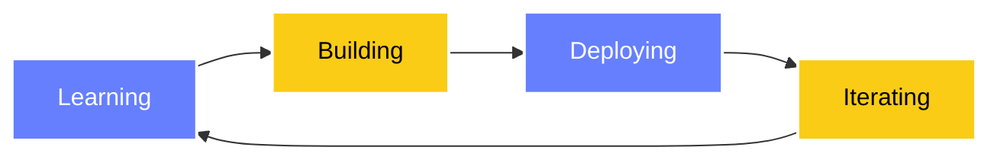

<div align="center">

<!-- Hero Banner -->


<!-- Profile Views & Dynamic Typing -->
<p align="center">
  
  
</p>

<p align="center">
  <a href="https://git.io/typing-svg">
    
  </a>
</p>

</div>

---

## 👨‍💻 About Me

<table>
<tr>
<td width="55%" valign="top">

```yaml
name: Abdellatif El Fagrouch
located_in: Tata, Morocco 🇲🇦
current_focus: ft_transcendence @ 1337
education: 42 Network - 1337 Coding School

interests:
  - Full Stack Development
  - System Architecture
  - Open Source Contribution
  - Anime & Manga ⛩️

currently_learning:
  - Advanced TypeScript Patterns
  - Microservices Architecture
  - Container Orchestration

philosophy: |
  "Write code that speaks for itself,
   Build systems that scale themselves,
   Create solutions that solve themselves."
```

</td>
<td width="45%" align="center">


### 📬 Get in Touch

<p align="center">
  <a href="mailto:rcabdw@gmail.com">
    
  </a>
  <a href="https://www.linkedin.com/in/abdellatifelfagrouch/">
    
  </a>
  <a href="https://x.com/Abdellatif_El_0">
    
  </a>
</p>

</td>
</tr>
</table>

---

## 📊 Performance Metrics

<div align="center">


<!-- Contribution Streak -->


<!-- 42 Badge -->
<br><br>
<a href="https://github.com/oakoudad/badge42">
  
</a>

<!-- Activity Graph -->
<br><br>


</div>

---

## 🛠️ Technology Stack

<div align="center">

### Core Languages


### Frontend Development


### Backend & Databases


### DevOps & Tools


### Additional Skills


</div>

<br>

<details>
<summary><b>🎯 Detailed Skill Breakdown</b></summary>
<br>

**Languages & Frameworks**
- **C/C++**: System programming, memory management, data structures
- **Python**: Scripting, automation, backend development
- **JavaScript/TypeScript**: Modern web development, type-safe code
- **React/Next.js**: Component-based architecture, SSR, SSG

**Backend Technologies**
- **Node.js & Express**: RESTful APIs, middleware design
- **Prisma ORM**: Type-safe database access
- **PostgreSQL/MySQL**: Relational database design

**DevOps & Deployment**
- **Docker**: Containerization, multi-stage builds
- **Nginx**: Reverse proxy, load balancing
- **Git**: Version control, collaborative workflows

**Tools & Platforms**
- **Linux**: Shell scripting, system administration
- **Figma**: UI/UX design, prototyping
- **VS Code**: Customized development environment

</details>

---

## 🚀 Featured Projects

<div align="center">

<table>
<tr>
<td width="50%">

### 🎮 ft_transcendence
**Full Stack Web Application**

A multiplayer Pong game with real-time features, user authentication, and social interactions.

**Tech:** Next.js, Prisma, PostgreSQL, WebSocket

[](https://github.com/Chidori42)

</td>
<td width="50%">

### 🔧 42 Projects
**System & Algorithm Challenges**

Collection of C/C++ projects focusing on algorithms, data structures, and system programming.

**Skills:** Low-level programming, Memory management

[](https://github.com/Chidori42)

</td>
</tr>
</table>

</div>

---

## 📈 Contribution Insights

<div align="center">


<table>
<tr>
<td width="50%">

</td>
<td width="50%">

</td>
</tr>
</table>

</div>

---

## 🎯 Current Focus



<div align="center">

**🔭 Currently working on:** ft_transcendence - Real-time multiplayer game platform  
**🌱 Learning:** Advanced TypeScript, Docker orchestration, System design patterns  
**💡 Open to:** Collaboration on open source projects, internship opportunities  
**⚡ Fun fact:** I debug with console.log and I'm not ashamed to admit it 😄

</div>

---

## 💭 Developer Quote

<div align="center">


</div>

---

## 🤝 Let's Connect

<div align="center">

I'm always interested in hearing about new projects and opportunities. Whether you want to collaborate, hire, or just chat about tech - feel free to reach out!

<p align="center">
  <a href="https://www.linkedin.com/in/abdellatifelfagrouch/">
    
  </a>
  <a href="mailto:rcabdw@gmail.com">
    
  </a>
  <a href="https://x.com/Abdellatif_El_0">
    
  </a>
  <a href="https://discord.com">
    
  </a>
</p>

<br>

**📧 Email:** rcabdw@gmail.com  
**📍 Location:** Tata, Morocco 🇲🇦  
**🌐 Portfolio:** https://abdellatifelfagrouch.me/

</div>

---

<div align="center">

### 🎵 Recent Activity

<!--START_SECTION:activity-->
<!--END_SECTION:activity-->

<br>

<!-- Snake Animation -->
<picture>
  <source media="(prefers-color-scheme: dark)" srcset="https://raw.githubusercontent.com/Chidori42/Chidori42/output/github-contribution-grid-snake-dark.svg">
  <source media="(prefers-color-scheme: light)" srcset="https://raw.githubusercontent.com/Chidori42/Chidori42/output/github-contribution-grid-snake.svg">
  
</picture>

</div>

---

<div align="center">

### ⭐ Show Some Love

If you find my work interesting, consider giving a star to my repositories!


<br><br>


<br>

**💡 "Code is poetry written in logic"**


<br>


</div>
